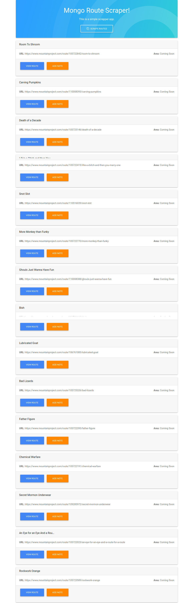

# Node Express Handlebars application

#### This application scrapes a webste and adds the data to a mongoDB database

## Use Instructions

1. To run this app, you'll need to install the following NPM packages.

   * [Body Parser](https://www.npmjs.com/package/body-parser) run _npm install body-parser_ 
   
   * [Express](https://www.npmjs.com/package/express) run _npm install express_ 
      
   * [Express Handlebars](https://www.npmjs.com/package/express-handlebars) run _npm install express-handlebars_ 

   * [Cheerio](https://www.npmjs.com/package/cheerio) run _npm install cheerio_ 

   * [Mongoose](https://www.npmjs.com/package/mongoose) run _npm install mongoose_ 

   * [Request](https://www.npmjs.com/package/request) run _npm install request_    
   

2. You will need to configure mongoDB on your local machine to run this app. Once you have mongoDB configured correctly you are ready to run the app

3. Once mongo is running and you have installed the required dependencies run the app by running _node server.js_ or _nodemon serverjs_

4. The database in this project is called _routescrapper_ but you can name your database anythignyou like.  
    _Just edit line 13 in the file "[/server.js](/server.js)"_

## Front end

###### Thanks for checking out my project! If you have any questions get in touch!
